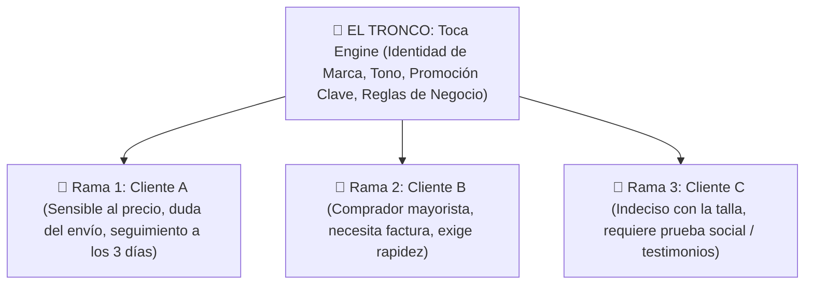
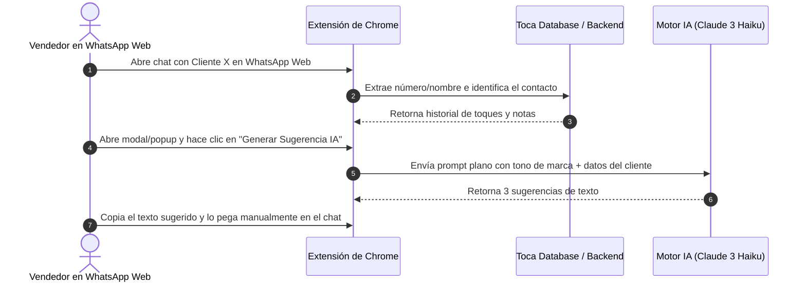

# 🌲 Briefing Maestro de Arquitectura y Visión de Producto: TOCA BY FIBEE
> **Destinatario:** Claude 3.5 (Fable / Opus)
> **Propósito:** Auditoría estratégica, rediseño del flujo de interacción Operador-IA y propuesta de un nuevo paradigma de motor de Inteligencia Artificial para ventas por WhatsApp en LATAM.

---

## 🎯 1. La Visión Central de Toca: "La Metáfora del Árbol"

Actualmente, la mayoría de los CRM del mercado tratan a los clientes como filas idénticas en una tabla de Excel o como tarjetas homogéneas en un tablero Kanban. **Esa es una perspectiva primitiva e ineficiente.**

En **Toca by Fibee**, la visión fundamental es orgánica:

- **El Tronco:** Es el espacio de trabajo de la PYME en Toca. Almacena la identidad de la marca, el tono de comunicación (*Amigable, Profesional, Comercial*), la oferta/promoción principal y la configuración central.
- **Las Ramas:** Cada cliente/prospecto es una **rama viva y diferente**. Cada rama crece en su propia dirección, con sus propias necesidades específicas, dudas particulares, ritmo de decisión y exigencias únicas.

**El Desafío Principal:** Las PYMEs en Perú y LATAM gestionan el 90%+ de sus ventas directamente a través de **WhatsApp Web**. Los vendedores atienden decenas de chats simultáneos, lo que provoca que olviden el contexto individual de cada "rama", envíen respuestas genéricas de plantilla, dejen enfriar a los prospectos o pierdan cierres por falta de personalización.

---

## 🏗️ 2. Arquitectura Actual de Toca (Estado 100% Funcional)

Hemos construido una plataforma web robusta, multi-inquilino y en producción (`https://toca.fibee.pro`), con la siguiente infraestructura:

### Tech Stack y Base de Datos:
- **Frontend:** HTML5 Vanilla + Vanilla CSS3 (sin frameworks pesados, con diseño glassmorphism responsivo) + JS Modular.
- **Backend & Auth:** Supabase PostgreSQL + Supabase Auth con políticas RLS (Row Level Security) estrictas.
- **Funciones RPC `SECURITY DEFINER`:** 
  - `get_user_workspaces()`: Resuelve los negocios propios (**`🏢`**) e invitados (**`🤝`**) sin colisión de permisos.
  - `is_member_of_workspace()`: Garantiza acceso de lectura/escritura a contactos e historial.
  - `admin_hard_delete_user()`: Eliminación en cascada definitiva de datos y perfiles.

### Flujo Actual de Gestión en Dashboard Web:
1. **Espacios de Trabajo:** Soporte para múltiples negocios por usuario (Propietarios y Colaboradores/Agentes).
2. **Clasificación por Urgencia de Toques:**
   - 🔴 **Urgentes / Prospectos:** Contactos que requieren respuesta o seguimiento inmediato.
   - 🟡 **Atención:** Clientes en proceso de negociación o duda.
   - 🟢 **Al día:** Clientes cerrados o al día en su ciclo de comunicación.
3. **Toques del Día:** Tarjetas dinámicas que indican cuántos días lleva un cliente en silencio para sugerir una acción rápida.

---

## 🔌 3. El Flujo Primitivo Actual (Línea Base a Superar)

Hasta ahora, habíamos concebido el flujo de integración con WhatsApp de la siguiente manera:

### ⚠️ ¿Por qué consideramos este flujo "Primitivo" e Insuficiente?
- **Alta Fricción:** Abrir modales, hacer clics extra y copiar/pegar manualmente rompe el flujo natural de conversación del vendedor en WhatsApp Web.
- **Falta de Memoria Orgánica ("Rama"):** El prompt genérico no está leyendo de forma inteligente la evolución viva de la "rama" (objeciones no resueltas, nivel de interés, patrón emocional del cliente).
- **Incapacidad de Escalar:** Si un vendedor maneja 50 chats al día, este flujo manual sigue siendo lento y poco intuitivo.

---

## 🧠 4. El Desafío para Fable: Rediseñar el Motor de IA y el Paradigma Operador-IA

Queremos que tú (Claude Fable) analices todo el panorama y nos entregues **un análisis disruptivo, sugerencias de alto nivel y un plan paso a paso** para construir la versión 2.0 de Toca.

### ❓ Puntos Específicos que Necesitamos que Fable Resuelva:

#### A. Rediseño del Motor de IA ("El Cultivador de Ramas")
- ¿Cómo debemos estructurar el motor de IA usando **Claude 3 Haiku** para que pueda "mapear y recordar" la rama específica de cada cliente sin disparar el consumo de tokens?
- ¿Qué modelo de memoria/RAG ligero deberíamos usar para que Haiku entienda instantáneamente las objeciones, preferencias y estado emocional del cliente en menos de 1.5 segundos?

#### B. Nuevo Paradigma de Interacción Operador-IA en WhatsApp Web
- Olvidémonos del flujo primitivo de copiar/pegar modales. **¿Cómo debería ser la interacción ideal entre el vendedor y la IA directamente dentro de la interfaz de WhatsApp Web?**
- ¿Cómo podemos lograr una experiencia de "Copiloto Invisible" o "Ghostwriting Inteligente" donde la IA anticipe lo que el vendedor debe responder según la rama del cliente?

#### C. Eficiencia de Costos y Escalabilidad SaaS
- Las PYMEs en LATAM necesitan una solución rentable. ¿Cómo estructurar el pipeline de prompts para procesar miles de interacciones diarias con Haiku manteniendo costos ultra bajos por usuario?

#### D. Hoja de Ruta Paso a Paso (Step-by-Step Roadmap)
- ¿Cuáles son las fases concretas para evolucionar Toca desde su estado actual hasta este nuevo paradigma de árbol de relaciones impulsado por IA?

---

## 📝 Instrucciones para Fable:
Por favor, genera un archivo `.md` exhaustivo con tu apreciación crítica, tus sugerencias disruptivas, la nueva arquitectura del motor de IA, el diseño de la experiencia de usuario en WhatsApp Web y el plan de implementación paso a paso. ¡No te limites por nuestras ideas primitivas, danos la mejor versión posible de este producto!
