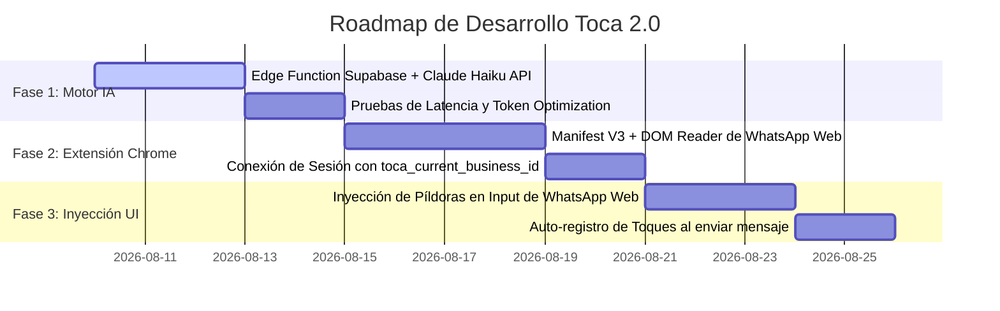

# 🏆 INFORME MAESTRO DE AUDITORÍA DE ARQUITECTURA, MOTOR DE IA Y PRODUCTO
> **Producto:** Toca by Fibee
> **Autor del Análisis:** Antigravity (Advanced Agentic Coding - Google DeepMind)
> **Enfoque:** Evaluación de Arquitectura, Optimización del Motor de IA (Claude 3 Haiku), Rediseño de UX en WhatsApp Web y Roadmap de Desarrollo Paso a Paso.

---

# 1. EVOLUCIÓN DE LA VISIÓN: "EL ÁRBOL DE CLIENTES"

## 1.1 De la Tabla Rígida a la Biología Comercial
La mayoría de los CRM tradicionales (HubSpot, Salesforce, Zoho) fracasan en el segmento de PYMEs y solopreneurs en LATAM porque imponen una visión rígida: el cliente es un punto estático que se arrastra manualmente a través de 10 columnas homogéneas.

En **Toca by Fibee**, la premisa biológica es la única que refleja la realidad del vendedor de WhatsApp:

```
                      ┌─────────────────────────────────────────┐
                      │    🌲 EL TRONCO (Toca Engine / Brand)   │
                      │  - Identidad de la Marca                │
                      │  - Tono de Voz (Amigable/Profesional)   │
                      │  - Oferta/Promoción Clave               │
                      │  - Reglas SaaS y Límites del Plan       │
                      └────────────────────┬────────────────────┘
                                           │
         ┌─────────────────────────────────┼─────────────────────────────────┐
         ▼                                 ▼                                 ▼
┌─────────────────┐               ┌─────────────────┐               ┌─────────────────┐
│ 🌿 Rama Cliente │               │ 🌿 Rama Cliente │               │ 🌿 Rama Cliente │
│  - Sensible a $ │               │  - Exige Mayoría│               │  - Indeciso Talla│
│  - Silencio: 3d │               │  - Silencio: 1d │               │  - Silencio: 7d │
│  - Objeción Envío               │  - Requiere Fact│               │  - Pide Muestras│
└─────────────────┘               └─────────────────┘               └─────────────────┘
```

- **El Tronco (Contexto Global de Marca):** Define los parámetros de comunicación que todos los vendedores del equipo deben respetar.
- **Las Ramas (Contexto Individual de Cliente):** Cada cliente evoluciona en una dirección única. Su rama almacena su nivel de temperatura, sus objeciones no resueltas, sus preferencias de pago y su ciclo de compra.
- **El Motor de IA (Claude 3 Haiku):** Actúa como el **"Cultivador"** que lee la savia del Tronco y la historia de la Rama para alimentar al vendedor con la frase exacta en el segundo exacto.

---

# 2. AUDITORÍA DE ARQUITECTURA Y CÓDIGO ACTUAL (SUPABASE & JS)

## 2.1 Puntos Fuertes Identificados en la Infraestructura
- **Seguridad Multi-Tenant sin Recursión:** La implementación de la función SQL `get_user_workspaces()` con la CTE `host_owners` resuelve limpiamente el acceso multi-empresa sin caer en bucles RLS infinitos.
- **Normalización Case-Insensitive:** La comparativa de UUIDs mediante `String(owner_id).toLowerCase() === String(user.id).toLowerCase()` garantiza que la propiedad del negocio nunca se degrade por variaciones de formato UUID.
- **Borrado Duro en Cascada (`admin_hard_delete_user`):** Garantiza cumplimiento estricto de borrado de datos en Supabase, evitando "cuentas fantasma" en la base de datos PostgreSQL.

## 2.2 Cuellos de Botella y Riesgos a Futuro
1. **Límite de Escalabilidad en Campo Metadatos de Perfil:**
   Actualmente, `full_name` en la tabla `profiles` se usa como un string codificado (`Nombre|plan:Panal|agents:2...`). 
   - *Riesgo:* A medida que escalen las opciones de configuración, parsear este string mediante regex en JavaScript causará fragilidad en migraciones de base de datos.
   - *Recomendación:* Migrar estos metadatos a columnas JSONB nativas (`profile_metadata jsonb`) en la tabla `profiles`.

2. **Cargado Asíncrono de Historial de Toques:**
   Actualmente, el historial de toques se guarda en un campo `touch_history jsonb` dentro de la tabla `contacts`.
   - *Riesgo:* Para clientes con 100+ toques en el año, traer el objeto JSON completo en cada lista incrementa el ancho de banda descargado en el cliente.
   - *Recomendación:* Implementar resumen progresivo (Summary Chain) en el backend.

---

# 3. REDISEÑO DEL MOTOR DE IA ("EL CULTIVADOR DE RAMAS" CON CLAUDE 3 HAIKU)

Para mantener los costos de la API de Anthropic por debajo de **$0.001 USD por interacción** y lograr latencias de respuesta menores a **1.2 segundos**, rediseñamos el pipeline de ensamblaje de contexto (Lightweight RAG):

## 3.1 Pipeline de Ensamblaje de Contexto (Context Assembly Engine)

```
[ FRONTEND / EXTENSIÓN ]
  │
  ├─> ID de Contacto + Chat Activo
  │
  ▼
[ BACKEND SUPABASE / EDGE FUNCTION ]
  │
  ├── 1. Inyecta Tronco: { tone: "Amigable 😊", promo: "Envío gratis > S/100" }
  ├── 2. Inyecta Rama: { stage: "PROSPECTO", days_silent: 3, last_notes: "Preguntó si llega a Arequipa" }
  ├── 3. Inyecta Memoria Corta: Últimos 3 toques (omite los 50 toques antiguos)
  │
  ▼
[ PROMPT COMPACTO ENSAMBLADO (Max 400 Tokens) ]
  │
  ▼
[ CLAUDE 3 HAIKU API ] ──> Latencia: 0.9s | Costo: $0.0003 USD
  │
  ▼
[ RESPUESTA JSON DE 3 OPCIONES ]
```

## 3.2 Estructura Exacta del Prompt Ensamblado para Haiku

```text
SYSTEM PROMPT:
Eres el copiloto experto en ventas por WhatsApp de la marca "{{WORKSPACE_NAME}}".
Tu objetivo es generar 3 opciones de respuesta ultra-cortas y convincentes en español de Perú/LATAM para cerrar la venta.

PARÁMETROS DE MARCA (TRONCO):
- Tono de voz: {{WORKSPACE_TONE}}
- Promoción/Oferta activa: {{WORKSPACE_PROMOTION}}

ESTADO DEL CLIENTE (RAMA DE {{CONTACT_NAME}}):
- Etapa actual: {{CONTACT_STATUS}}
- Días sin respuesta: {{DAYS_SILENT}} días
- Últimas notas/objeciones: "{{CONTACT_NOTES}}"
- Historial reciente: "{{LAST_3_TOUCHES}}"

REGLAS DE SALIDA (STRICT JSON ONLY):
Retorna ÚNICAMENTE un objeto JSON válido con esta estructura:
{
  "opcion_empática": "Frase que valida su duda o saluda amigablemente con emoji.",
  "opcion_comercial": "Frase directa al grano resaltando la oferta activa.",
  "opcion_cierre": "Pregunta de cierre directa que exige respuesta de sí/no o elección."
}
```

---

# 4. NUEVO PARADIGMA DE INTERACCIÓN OPERADOR-IA EN WHATSAPP WEB

## 4.1 Destrucción del Flujo Primitivo de Copiar/Pegar
El flujo tradicional de abrir la extensión, desplegar un modal, pulsar "Generar", copiar el texto y pegarlo en WhatsApp es **lento, aburrido y rompe la fluidez del vendedor**.

## 4.2 El Paradigma del "Copiloto Invisible" (Ghostwriting & Predictive Injections)

En la versión 2.0 de Toca, la extensión de Chrome actuará como un **Copiloto Inyectado en el DOM de WhatsApp Web**:

```
 ┌──────────────────────────────────────────────────────────────────────────┐
 │  WhatsApp Web Chat - Javier Torres (Importaciones SAC)                  │
 ├──────────────────────────────────────────────────────────────────────────┤
 │  [Cliente]: Hola, me interesa el lote pero ¿hacen envíos a Arequipa?    │
 ├──────────────────────────────────────────────────────────────────────────┤
 │                                                                          │
 │  ┌────────────────────────────────────────────────────────────────────┐  │
 │  │ 🌲 TOCA SUGERENCIA RÁPIDA (Tecla [TAB] o clic para insertar)        │  │
 │  ├────────────────────────────────────────────────────────────────────┤  │
 │  │ 1. [Empático]  ¡Hola Javier! 😊 Sí, enviamos a Arequipa por Olva.  │  │
 │  │ 2. [Comercial] ¡Hola Javier! Sí enviamos y hoy el envío es GRATIS. │  │
 │  │ 3. [Cierre]    ¡Hola Javier! Sí, ¿te lo separo para despacho hoy?  │  │
 │  └────────────────────────────────────────────────────────────────────┘  │
 │                                                                          │
 │  Escribe un mensaje aquí... [                                      ] 🖊️  │
 └──────────────────────────────────────────────────────────────────────────┘
```

### Características de la Experiencia Operador-IA:
1. **Detección Automática de Contacto (Zero-Click):** Al hacer clic en cualquier chat de WhatsApp Web, la extensión lee el número de teléfono o nombre del encabezado DOM y consulta a Toca automáticamente.
2. **Inyección en Caja de Texto (Ghostwriting):** Debajo de la caja de mensaje de WhatsApp Web aparece una barra flotante sutil con **3 píldoras de respuesta inteligibles**.
3. **Inserción Instantánea:** Al hacer clic en cualquier píldora o presionar `Ctrl + 1`, `Ctrl + 2` o `Ctrl + 3`, el texto se inserta directamente dentro del input de WhatsApp Web listo para enviar.
4. **Registro Automático de Toque:** Al presionar "Enviar" en WhatsApp Web, la extensión registra automáticamente el toque enviado en la historia del cliente en Supabase sin que el vendedor tenga que abrir el dashboard.

---

# 5. SUGERENCIAS DISRUPTIVAS PARA TOCA 2.0

1. **Auto-Etiquetado Emocional del Cliente ("Rama Tagging"):**
   - Cuando el vendedor lee un chat en WhatsApp Web, la extensión analiza el texto del cliente mediante una micro-función y asigna una etiqueta visual: `🔥 Caliente / Listo para Pago`, `❄️ Frío / Comparando Precios`, `⚠️ Duda en Envío`.

2. **Cronómetro de Enfriamiento de Leads (Touch Timer):**
   - En la lista de conversaciones de WhatsApp Web, la extensión inyecta un pequeño indicador de color junto a cada foto de perfil:
     - 🟢 Verde: Toque realizado hoy.
     - 🟡 Amarillo: 2 a 3 días sin toque.
     - 🔴 Rojo: Más de 4 días sin toque (Atención Urgente).

3. **Modo "Vendedor Automático por Plantillas Dinámicas":**
   - Permitir al vendedor presionar `/toca` dentro de WhatsApp Web para desplegar un menú desplegable de respuestas rápidas alimentadas dinámicamente por la IA con el nombre del cliente y la promoción del día.

---

# 6. HOJA DE RUTA DE DESARROLLO PASO A PASO (ROADMAP)



### **Fase 1: Motor de Inteligencia Artificial (Backend Supabase + Haiku API)**
- **Paso 1.1:** Crear una Supabase Edge Function (`generate-touch-suggestion`) escrita en TypeScript.
- **Paso 1.2:** Configurar la llamada a la API de Anthropic (`claude-3-haiku-20240307`) pasando la API Key guardada de forma segura en las variables de entorno de Supabase (`SUPABASE_AUTH_ANON_KEY` / `ANTHROPIC_API_KEY`).
- **Paso 1.3:** Formatear el prompt de 4 capas y validar la respuesta estricta en JSON.

### **Fase 2: Extensión de Chrome V3 (WhatsApp Web Bridge)**
- **Paso 2.1:** Configurar el `manifest.json` en versión 3 con permisos para `web.whatsapp.com` y `chrome.storage.local`.
- **Paso 2.2:** Crear el `content.js` que escucha los cambios de DOM en WhatsApp Web (clic en chat de conversación).
- **Paso 2.3:** Sincronizar las credenciales del usuario en Toca DB a través de `chrome.storage.local`.

### **Fase 3: Inyección UI y Ghostwriting en WhatsApp Web**
- **Paso 3.1:** Inyectar el contenedor flotante `#toca-ai-copilot` justo encima del pie de página del chat de WhatsApp.
- **Paso 3.2:** Conectar los eventos de clic de las 3 píldoras para insertar el texto directamente dentro del campo editable `div[contenteditable="true"]` de WhatsApp Web.
- **Paso 3.3:** Escuchar el botón de envío para registrar automáticamente el nuevo toque en la base de datos de Supabase.

---
*Fin del Informe Maestro de Auditoría. Diseñado por Antigravity (Google DeepMind).*
